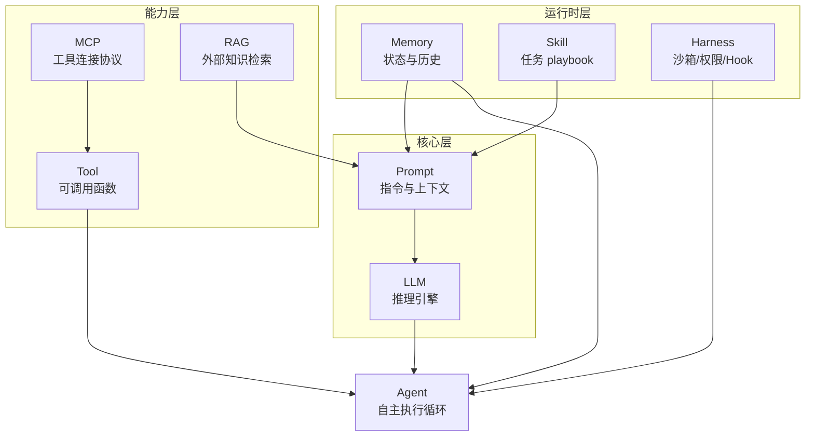

# AI Agent 核心名词速查手册

> 面向 LLM 应用与 Agent 开发的术语说明：含义、原理、作用及彼此关系。  
> 可与本仓库 [LangChain Agent 从 0 到 1](../README.md) 学习路径对照阅读。

---

## 目录

1. [LLM（大语言模型）](#1-llm大语言模型)
2. [Prompt（提示词）](#2-prompt提示词)
3. [Tool（工具）](#3-tool工具)
4. [MCP（Model Context Protocol）](#4-mcpmodel-context-protocol)
5. [RAG（检索增强生成）](#5-rag检索增强生成)
6. [Memory（记忆）](#6-memory记忆)
7. [Agent（智能体）](#7-agent智能体)
8. [Skill（技能）](#8-skill技能)
9. [补充名词](#9-补充名词)
10. [整体关系与典型工作流](#10-整体关系与典型工作流)

---

## 1. LLM（大语言模型）

### 含义

**LLM（Large Language Model）** 是基于海量文本训练的概率模型，给定一段输入（上下文），预测下一个 token，从而生成连贯的自然语言或结构化输出。

### 原理（简化）

```
输入 Token 序列 → Transformer 编码/解码 → 逐 token 采样 → 输出文本
```

- **预训练**：从互联网/书籍等语料学习语言规律与世界知识（参数内隐记忆）。
- **对齐（SFT / RLHF 等）**：让模型更听话、更安全、更符合指令。
- **推理时**：通过 `temperature`、`top_p` 等控制随机性；通过 **上下文窗口** 限制一次能"看到"的文本长度。

### 作用

- 理解自然语言、生成文本、翻译、摘要、推理、写代码等。
- 在 Agent 体系中，LLM 是 **决策与推理的核心引擎**，负责理解任务、规划步骤、选择工具、整合结果。

### 在本仓库中的对应

| 章节 | 示例 |
| --- | --- |
| `01_basics/` | `01_hello_llm.py` — 最基础的模型调用 |
| `01_basics/` | `05_streaming.py` — 流式输出 |

---

## 2. Prompt（提示词）

### 含义

**Prompt** 是发给 LLM 的输入指令与上下文，包括系统角色设定、用户问题、历史对话、工具说明、检索到的文档等。  
**Prompt Engineering（提示工程）** 指通过结构化、模板化方式提高输出质量与稳定性。

### 原理

LLM 没有"程序入口"，一切行为都由 **输入文本** 塑造：

```
System Prompt（你是谁、规则是什么）
    +
Few-shot Examples（示例输入输出）
    +
User Message（当前任务）
    +
Retrieved Context（RAG 注入的知识）
    +
Tool Descriptions（可用工具 schema）
    → LLM 生成回复或 tool_call
```

常见技术：角色设定、Chain-of-Thought（逐步推理）、JSON 模式约束、Prompt 模板变量替换。

### 作用

- 定义 Agent 的 **人格、边界、输出格式**。
- 把外部知识（RAG）、工具能力、记忆片段 **注入** 模型上下文。
- 是连接"业务需求"与"模型行为"的最直接杠杆。

### 在本仓库中的对应

| 章节 | 示例 |
| --- | --- |
| `01_basics/` | `03_prompt_template.py` — Prompt 模板 |
| `01_basics/` | `04_output_parser.py` — 结构化输出解析 |

---

## 3. Tool（工具）

### 含义

**Tool** 是 Agent 可调用的外部能力：搜索网页、读写文件、执行 SQL、调用 API、运行代码等。  
对 LLM 而言，工具通常以 **函数名 + 参数 schema（JSON Schema）** 的形式描述；模型输出 `tool_call`，由运行时执行并返回结果。

### 原理

典型 **ReAct** 循环：

```
用户任务
  → LLM 思考："我需要查天气"
  → LLM 输出 tool_call: get_weather(city="北京")
  → 运行时执行工具，得到 {"temp": 28}
  → 结果作为 ToolMessage 塞回上下文
  → LLM 基于结果生成最终回答
```

LangChain 中用 `@tool` 装饰器定义；`bind_tools()` 把工具 schema 绑定到模型。

### 作用

- 突破 LLM **知识截止、无法行动、易幻觉** 的限制。
- 让 Agent 能 **感知环境、修改状态、与真实系统交互**。

### 在本仓库中的对应

| 章节 | 示例 |
| --- | --- |
| `05_tools_agents/` | `01_define_tools.py`、`02_bind_tools.py` |
| `05_tools_agents/` | `03_react_agent.py` — 手写 ReAct 循环 |
| `06_langgraph/` | `03_tool_node.py` — 图结构中的工具节点 |
| `08_agent_harness/` | `tools.py` — 沙箱化 read/write/bash 等 |

---

## 4. MCP（Model Context Protocol）

### 含义

**MCP（Model Context Protocol）** 是 Anthropic 推动的 **开放协议**，用于标准化 **AI 应用 ↔ 外部工具/数据源** 之间的连接方式。  
可以把它理解为：**Tool 的"USB 接口标准"** —— 一次实现 MCP Server，多个客户端（Cursor、Claude Desktop 等）都能即插即用。

### 原理

```
┌─────────────┐     MCP 协议      ┌──────────────┐
│  MCP Client │ ◄──────────────► │  MCP Server  │
│ (Cursor/IDE)│   JSON-RPC 等     │ (Jira/Git/DB)│
└─────────────┘                   └──────────────┘
        │                                  │
        ▼                                  ▼
   LLM / Agent                      Tools + Resources
```

MCP Server 暴露三类能力：

| 类型 | 说明 | 类比 |
| --- | --- | --- |
| **Tools** | 可执行的操作（搜索、创建工单） | 函数调用 |
| **Resources** | 只读数据（文档、配置） | 文件/API 读取 |
| **Prompts** | 预置提示模板 | Prompt 库 |

### 作用

- **解耦**：工具实现与 Agent 框架分离，避免每个产品重复对接 Jira、Slack、数据库。
- **可组合**：多个 MCP Server 同时挂载，Agent 按需选用。
- **安全边界**：Server 侧控制权限与数据范围。

### 与 Tool 的关系

- **Tool** 是概念层："模型能调用的能力"。
- **MCP** 是协议层："这些能力如何被发现、描述、调用"。
- 在 Cursor 中，MCP 工具最终也会以 **Tool** 形式呈现给 Agent。

---

## 5. RAG（检索增强生成）

### 含义

**RAG（Retrieval-Augmented Generation）** 在生成回答前，先从外部知识库 **检索** 相关文档片段，再 **注入 Prompt**，让 LLM 基于真实资料作答，而非仅靠参数记忆。

### 原理

```
离线阶段（Indexing）：
  文档 → 切分 Chunk → Embedding 向量化 → 存入向量库

在线阶段（Retrieval + Generation）：
  用户问题 → Embedding → 向量相似度检索 Top-K 片段
           → 拼入 Prompt → LLM 生成带引用的回答
```

常见增强：多查询改写、混合检索（向量 + 关键词）、重排序（Reranker）、Parent Document 等。

### 作用

- 接入 **私有/实时知识**（企业文档、产品手册、代码库）。
- 降低幻觉，支持 **引用来源**。
- 无需微调模型即可更新知识。

### 在本仓库中的对应

| 章节 | 示例 |
| --- | --- |
| `04_rag/` | 完整 RAG 链路：加载 → 切分 → Embedding → 向量库 → 问答 |
| `07_project_knowledge_bot/` | RAG + 多轮对话 + 引用来源的综合项目 |

---

## 6. Memory（记忆）

### 含义

**Memory** 是 Agent 在多轮、长任务中 **保留与复用上下文** 的机制。不仅是对话历史，还包括用户偏好、任务状态、长期事实等。

### 原理

记忆通常分层设计：

| 类型 | 生命周期 | 典型实现 |
| --- | --- | --- |
| **短期 / Session** | 当前对话线程 | `ChatMessageHistory`、LangGraph Checkpoint |
| **工作记忆** | 当前任务规划 | Todo 列表、AgentState |
| **长期记忆** | 跨会话 | 向量库、用户画像表、知识图谱 |
| **程序性记忆** | 持久规则 | System Prompt、Skill 文件 |

读取策略：全量注入、按需检索、超阈值 **压缩（Compaction）**。

### 作用

- 多轮对话 **连贯性**（"刚才说的那个"）。
- 长任务 **可恢复**（中断后继续）。
- 跨会话 **个性化**（记住用户偏好）。

### 在本仓库中的对应

| 章节 | 示例 |
| --- | --- |
| `03_memory/` | ChatHistory、RunnableWithMessageHistory、消息裁剪 |
| `08_agent_harness/` | `compression.py` — 历史超阈值时摘要压缩 |
| `docs/agent-memory-architectures.md` | 记忆架构设计深度文档 |

---

## 7. Agent（智能体）

### 含义

**Agent** 是以 LLM 为"大脑"、能 **自主规划、调用工具、迭代执行** 直到完成目标的程序实体。  
狭义：**LLM + Tools + Loop**；广义：还包括 Memory、RAG、权限、Hook 等 **Harness（运行时）** 层。

### 原理

经典 Agent Loop：

```
┌──────────────────────────────────────┐
│  Observe（观察：用户输入 + 环境状态）   │
│       ↓                              │
│  Think（LLM 推理：下一步做什么）        │
│       ↓                              │
│  Act（执行 Tool / 输出最终答案）      │
│       ↓                              │
│  未完成？→ 回到 Observe               │
└──────────────────────────────────────┘
```

实现形态：

- **ReAct Agent**：推理 + 行动交替。
- **Plan-and-Execute**：先规划再逐步执行。
- **Multi-Agent**：Supervisor 派发多个子 Agent 并行（如 Deep Research）。
- **LangGraph StateGraph**：用图结构表达循环、分支、人在回路。

### 作用

- 把 LLM 从 **"聊天机器人"** 升级为 **"能办事的助手"**。
- 自动化多步骤任务：写代码、做调研、操作文件、调用 API。

### Agent vs Harness

| 概念 | 职责 |
| --- | --- |
| **Agent** | LLM 决策 + 工具调用逻辑 |
| **Harness** | 沙箱、权限、Hook、压缩、Checkpoint、错误预算、子 Agent 派发 |

> 生产环境中 90% 的复杂度往往在 **Harness 层**，而非 LLM 调用本身。

### 在本仓库中的对应

| 章节 | 示例 |
| --- | --- |
| `05_tools_agents/` | `create_agent`、ReAct |
| `06_langgraph/` | StateGraph、ToolNode、人在回路 |
| `08_agent_harness/` | 迷你 Claude Code 风格完整 Harness |
| `09_deep_research/` | 多 Agent 并行深度调研 |

---

## 8. Skill（技能）

### 含义

**Skill** 是给 AI Agent 的 **结构化操作指南**：何时使用、分几步做、遵循什么规范、调用哪些工具。  
在 Cursor 等产品中，Skill 通常是一个 `SKILL.md` 文件，Agent 在相关任务时 **先读取再执行**，相当于可复用的"岗位 SOP"。

### 原理

```
用户任务："帮我创建 Cursor Hook"
    → Agent 识别任务类型
    → 读取 create-hook/SKILL.md
    → 按 Skill 中的步骤、格式、约束执行
    → 产出符合规范的结果
```

Skill 与 Prompt 的区别：

| | Prompt | Skill |
| --- | --- | --- |
| 粒度 | 单次对话指令 | 可复用任务 playbook |
| 触发 | 用户/系统直接写入 | Agent 按需检索读取 |
| 内容 | 短、即时 | 长、分步骤、含领域知识 |

### 作用

- **标准化**复杂工作流（写 PR、配 MCP、做安全审查）。
- **降低幻觉**：明确步骤与边界，减少 Agent 即兴发挥。
- **可分享、可版本管理**：团队共用同一套 Skill 库。

### 与 MCP / Tool 的关系

- **Tool / MCP**：提供 **能力**（能做什么）。
- **Skill**：提供 **方法论**（遇到某类任务该怎么用这些能力）。

---

## 9. 补充名词

| 名词 | 简要说明 |
| --- | --- |
| **Embedding** | 把文本映射为向量，用于语义相似度检索（RAG 核心） |
| **Vector Store** | 存储与检索 Embedding 的数据库（Chroma、FAISS、PGVector 等） |
| **Chain / LCEL** | 把多个步骤（Prompt → LLM → Parser）用管道 `\|` 串联 |
| **LangGraph** | 用状态图编排 Agent 循环、分支、并行、Checkpoint |
| **Checkpoint** | 保存 Agent 运行状态，支持中断恢复与多轮 thread |
| **Harness** | Agent 运行时基础设施（权限、Hook、沙箱、压缩等） |
| **Subagent** | 主 Agent 派生的子 Agent，隔离上下文、专注子任务 |
| **Hook** | 在工具调用前后插入的逻辑（审计、拦截、改写参数） |
| **Human-in-the-loop** | 关键步骤需人工批准再继续 |
| **Context Window** | 模型一次能处理的 token 上限，影响 Memory/RAG 策略 |

---

## 10. 整体关系与典型工作流

### 关系总览



### 一句话串联

> **LLM** 是大脑；**Prompt** 告诉它做什么；**RAG** 和 **Memory** 给它知识和回忆；**Tool**（经 **MCP** 标准化接入）让它能行动；**Skill** 教它复杂任务的标准做法；这一切由 **Agent** 循环编排，并运行在 **Harness** 之上。

### 典型问答 Agent 数据流

```
用户："根据我们产品文档，上次讨论的方案怎么部署？"
  │
  ├─ Memory ──→ 取出上轮对话摘要、用户偏好
  ├─ RAG ────→ 检索产品文档 Top-5 片段
  ├─ Skill ──→ （若识别为部署类任务）加载 deploy/SKILL.md
  │
  ▼
Prompt = System + Memory + RAG 片段 + Skill 要点 + 用户问题
  │
  ▼
LLM 推理 → 若需查服务器状态 → tool_call(check_deploy_status)
  │
  ▼
Tool 结果回灌 → LLM 生成最终回答（含引用）
  │
  ▼
Memory 更新本轮对话
```

### 与本仓库学习路径的映射

```
01 LLM / Prompt
  ↓
02 LCEL（链式组合）
  ↓
03 Memory
  ↓
04 RAG
  ↓
05 Tool + Agent  ← 主线开始
  ↓
06 LangGraph
  ↓
07 综合项目（RAG 问答 Bot）
  ↓
08 Agent Harness（生产级运行时）
  ↓
09 Multi-Agent Deep Research
```

---

## 参考资源

- [LangChain 官方文档](https://python.langchain.com/)
- [LangGraph 文档](https://langchain-ai.github.io/langgraph/)
- [MCP 规范](https://modelcontextprotocol.io/)
- 本仓库：`docs/agent-memory-architectures.md`、`docs/agent-frameworks.md`

---

*文档版本：2026-08 · 适用于 LangChain / Cursor Agent 生态*
